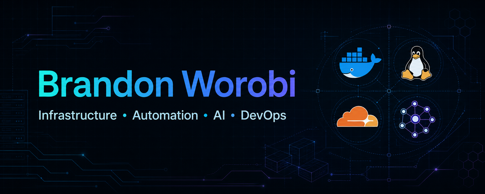

  

  
  
  

I build practical systems and web products—from infrastructure and deployment workflows to AI-assisted tools and small-business sites. I care about making technology useful, maintainable, and a little more human.

Based in Port Huron, Michigan · Independent · Scout Consultatory

## Core stack

  
  
  
  
  
  

## What I work on

- Infrastructure, Linux, containers, and deployment automation
- AI-assisted workflows, internal tools, and practical integrations
- Web applications, APIs, and product-focused websites
- Systems that turn messy real-world work into repeatable processes

## Selected projects

| Project | What it is |
| --- | --- |
| [Scout Consultatory](https://github.com/worobi/scout-consultatory) | AI-enhanced consulting and modern web experiences for small businesses. |
| [High Functioning Chaos](https://github.com/worobi/highfunctioningchaos.living) | Planners, templates, resources, and honest chaos-management tools for real life. |
| [HovelMatch](https://github.com/worobi/HovelMatch.xyz) | A satirical co-habitation matching experience for the beautifully underfunded. |
| [Moni's Munchies](https://github.com/worobi/MM-website) | A small-business website for baked goods, online orders, events, and cottage-food information. |
| [Worobi.com](https://github.com/worobi/worobi.com) | The Worobi family hub and personal-site directory. |
| [Velvet Grimoire](https://github.com/worobi/velvetgrimore.xyz) | An 18+ tabletop companion for maps, player notes, dice rolls, and session play. |
| [Resume Site](https://github.com/worobi/Resume_Site) | A Next.js and React resume and portfolio site. |

## GitHub activity

  

## Around the web

[Website](https://www.worobi.com) · [LinkedIn](https://www.linkedin.com/in/worobi/)
